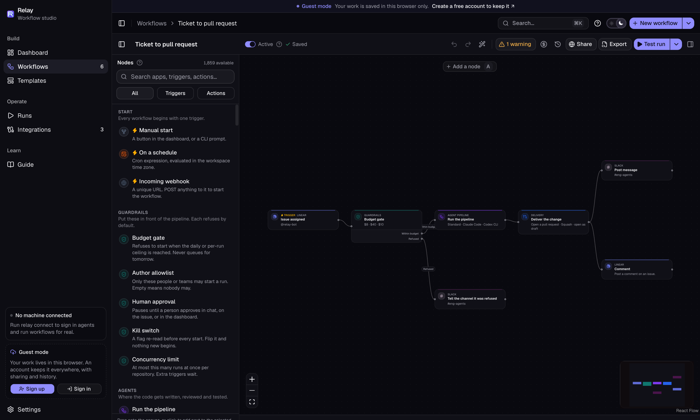
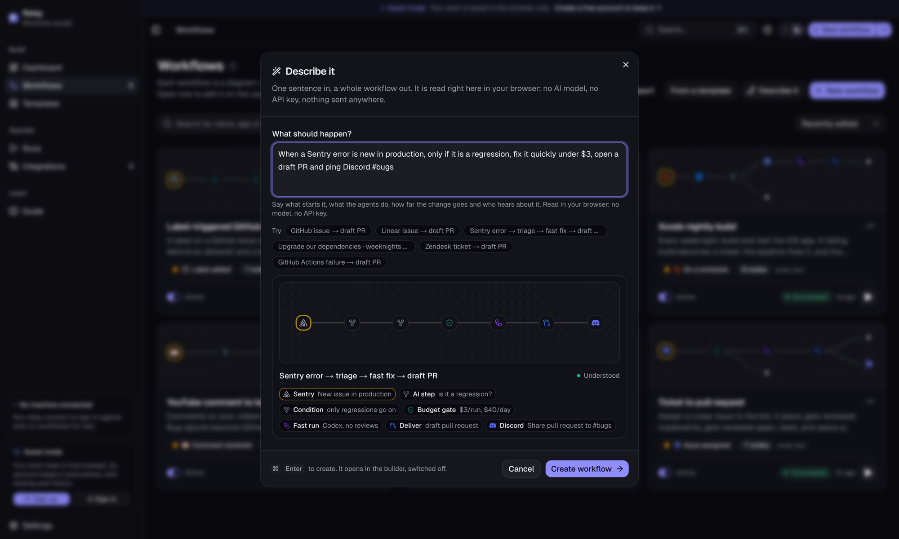
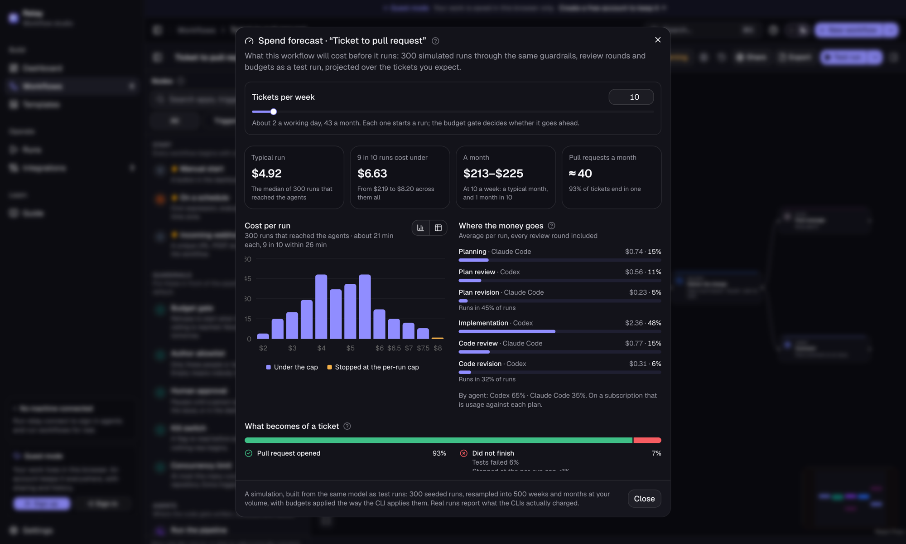

<p align="center">
  <picture>
    <source media="(prefers-color-scheme: dark)" srcset="web/public/brand/relay-logo-dark.svg">
    
  </picture>
</p>

# Relay

**Tickets in. Reviewed pull requests out.** A workflow studio where Claude Code
and Codex plan, cross-review, implement and test your tickets, behind guardrails
you draw on a canvas.

**[Try it live →](https://relay-olive-omega.vercel.app)** — no account needed to
look around; sign up free to keep your workflows, share them and get version
history.



Relay is a workflow builder for coding agents, in the spirit of n8n: you draw a
flow on a canvas once — what starts a run, the guardrails in front of it, the
agents, where the result goes and who hears about it — and Relay runs the same
steps every time a ticket arrives, stopping wherever a guardrail says no.

What makes it more than an automation canvas is the node in the middle. The
**Agent pipeline** is not one model call. Claude Code and Codex plan the work,
attack each other's plan against the real code, implement it in an isolated git
worktree, review each other's diff and run your test suite, and every claim they
make is checked against git rather than taken at face value. The result arrives
as a commit, a branch or a draft pull request, as far as you allow.

```
 Linear issue ──▶ Budget gate ──▶ Author allowlist ──▶ Agent pipeline ──▶ Deliver ──▶ Slack message
 assigned                                                                 draft PR    "PR #412 is ready"
 ────────────     ────────────────────────────────     ──────────────     ──────────────────────────────
 trigger          guardrails                           the engine         delivery and notification
```

## Quick start

**Open the studio:** <https://relay-olive-omega.vercel.app>. Try it as a guest —
your work stays in your browser — or create a free account, answer four
onboarding questions and get a first workflow built from your answers. Test
runs are simulated, so it costs nothing to try.

**Connect your machine** to make it real. The `relay` CLI is the studio's
companion: run it in the repository your workflows work on, and the studio can
sign in your own Claude Code and Codex, run a workflow for real there, and
install its export.

```bash
npm install -g github:aydinmrnv/relay
cd ~/code/your-repo
relay connect          # opens the studio with a one-time pairing link
```

1. **Open the studio** and start from a template, or from a blank canvas.
2. **Test-run it** with a sample ticket or your own JSON payload. Nodes and edges
   light up as the run travels, with the same phases, review rounds, budgets and
   refusals as a real run — and it costs nothing, because it is simulated.
3. **Run it on your machine.** With `relay connect` running, pick *Run on this
   machine* next to Test run, name an issue or describe the change, and watch
   the same canvas light up from a real run: the plan, the reviews, the diff,
   the tests and the pull request, with what the CLIs actually charged.
4. **Export it** to run unattended. *Install into your repository* writes the
   engine's config and a GitHub Actions workflow straight into it (or download
   them as a `.zip`), and the export lists each secret to add. Commit them, and
   the workflow runs for real on your own Actions minutes.

The **Guide** (`/guide`) walks through the same path and explains every concept
the studio uses.

## What only Relay does

- **Two vendors check each other.** The model that reviews a plan or a diff is
  never the one that wrote it (below).
- **Describe it, get a workflow.** Type one sentence — *"when a Sentry error is
  new, fix it under $3 and ping Discord"* — and the graph builds itself as you
  type. It is a parser over the live connector catalog, in your browser: no model
  call, no credits, nothing sent anywhere.
- **A spend forecast before the first run.** Hundreds of simulated runs of your
  exact graph give a typical and a bad-day cost per run, a monthly bill at your
  ticket volume, and how often your budget gate will refuse.
- **Share, remix and badge.** Publish a workflow at a public link with secrets,
  logins and your repository name stripped; anyone can remix it into their own
  studio, and a README badge points to it.
- **Version history.** A snapshot before every editing session, named versions
  on demand, and a restore you can undo.
- **Your subscriptions, your runners.** No API keys; agents run on your machine
  or your own Actions minutes, and Relay never sees your code.

| Describe it | Spend forecast |
|---|---|
|  |  |

## How a workflow is built

A workflow is a graph of nodes. Every node's ports are typed — an issue, a run,
a change, a message, an event — so the canvas refuses a connection that makes no
sense, like wiring a ticket into something that expects a pull request.

| Building block | Nodes |
|---|---|
| **Triggers** | 740 triggers across 240 apps: an issue labelled on GitHub or assigned in Linear, a new Sentry error, a Zendesk ticket, a schedule, an incoming webhook, a manual start |
| **Guardrails** | Budget gate, author allowlist, human approval, concurrency limit, kill switch. Each refuses by default and says why |
| **Agent pipeline** | Run the pipeline (choose the planner, plan reviewer, implementer and code reviewer, the review depth and the round limits), a fast run with no reviews, or a cost estimate |
| **Delivery** | Deliver the change — commit, branch, draft pull request, or merge when a person started the run — and comment the summary on the issue |
| **Logic** | Condition, filter, transform, an AI step for triage or classification, merge paths, wait, wait for business hours, notes |
| **Actions** | 1,119 actions: message Slack, Discord or Teams, open a Linear ticket, call any HTTP endpoint, post the run as JSON |

Select a node and the side panel shows its settings, what it will do with them,
and what it did in the last test run. Select nothing and the panel reads the
whole workflow back in plain English, with the apps and sign-ins it needs and
every check it has not passed.

### Templates

| Template | What it does |
|---|---|
| Ticket to pull request | A Linear issue assigned to the bot is planned, reviewed, implemented, reviewed again and tested, and opens a draft PR. Slack hears about it |
| Label-triggered GitHub run | A label on a GitHub issue starts an unattended run behind an allowlist and a budget; the summary lands back on the issue |
| Sentry error to fix | A model triages each new Sentry issue. Regressions get a fast fix and a draft PR; the rest become a Linear ticket |
| Xcode nightly build | Every weeknight, build and test the iOS app. A failing build becomes a ticket, the pipeline fixes it, and the team wakes up to a PR |
| YouTube comment to issue | Comments on your videos are classified by a model; bug reports become GitHub issues and a Discord ping |
| Support ticket to fix, with approval | A Zendesk ticket tagged `bug` waits for a person to approve, then runs the pipeline and replies to the customer with the PR |

## Running a workflow for real

There are two ways, and they use the same engine.

**On your machine, from the studio.** With `relay connect` running in your
repository, *Run on this machine* sends the compiled workflow to the companion,
which runs the pipeline there with your own sign-ins and streams every phase
back to the canvas. The trigger and the guardrails in front of the pipeline
decide whether an *event* may start a run, so a person pressing the button
passes over them; the per-run cost cap still applies, and delivery stops at a
pull request. Reload the tab mid-run and the studio picks the run back up.

**Unattended, from your repository.** Export compiles the graph into files your
repository already knows how to run — installed straight into it through
`relay connect`, or downloaded as a `.zip`:

| File | What it is |
|---|---|
| `.relay/config.json` | The engine's configuration: which agent plays which role, review depth, round limits, guardrails, how far delivery may go |
| `.github/workflows/<name>.yml` | A GitHub Actions workflow that runs the engine on your own runner minutes |
| `SETUP.md` | The secrets to add, and where each one comes from |
| `<name>-workflow.json` | The graph itself, to import back into the studio |

GitHub issue triggers and schedules become Actions events directly. Every
exported workflow can also be started by hand with an issue number
(`workflow_dispatch`) or by anything that can send an HTTP request
(`repository_dispatch`). Slack, Discord and HTTP actions are wired straight into
the YAML; any other app is posted as JSON to a bridge URL you choose — an n8n or
Zapier webhook, or your own server — which is the job the hosted product will
take over.

Whatever the canvas cannot express in those files is listed as a warning in the
export and in `SETUP.md`, never silently dropped. A paused workflow exports with
its trigger switched off.

## Bring your own subscription

There are no API keys to paste. Claude Code signs in with your Claude plan and
Codex with your ChatGPT plan: through `relay connect`, the studio starts each
CLI's own login on your machine and then asks that CLI whether it worked. Relay
never sees a token.

In GitHub Actions the export uses each vendor's supported way of carrying a
personal plan into CI — `CLAUDE_CODE_OAUTH_TOKEN` from `claude setup-token`, and
`CODEX_AUTH_JSON` holding `~/.codex/auth.json` — or API keys, if you prefer them.

Relay Cloud, the hosted runner, keeps the same rule: each user gets a cloud
machine of their own, signs Claude Code, Codex and GitHub in there through the
vendors' own pages, and Relay still never holds a token. It is built and
invite-only; [the design](docs/design/relay-cloud-runners.md) covers how that
machine is run, reached, kept cheap and kept working.

## Why a run nobody watched is worth reading

Running agents is the easy part. These are the rules that make the result
trustworthy. The engine enforces them on every run, and the studio checks the
ones a graph can break before it lets you test-run or export:

- **Nothing grades its own homework.** By default the model that reviews a plan
  or a diff is the other CLI, not the one that wrote it, and the studio warns if
  you give both roles to one. Reviewers run read-only, and an agent with no
  read-only mode cannot be made a reviewer at all.
- **Every claim is checked against git.** Relay computes the diff itself, judges
  tests by exit code and takes cost from what the CLIs report. An agent saying
  "done" proves nothing.
- **Unattended runs never merge.** A ticket assignment, a label, a schedule or a
  webhook is an unattended start; those runs stop at a draft pull request, and
  the studio refuses to export anything else.
- **Guardrails refuse by default.** An empty allowlist means nobody may start a
  run, and an unattended workflow will not start without a per-run and a daily
  budget.
- **Nothing leaves unscanned.** Delivery runs a secret scan between commit and
  push, and a hit stops the change at a local branch.
- **Your checkout is only read.** Agents work in a separate git worktree.

The full list, and how each rule is enforced, is under
[Safety](docs/cli.md#safety) in the engine reference.

## Status

Relay is in beta at <https://relay-olive-omega.vercel.app>, and free. Accounts
keep your workflows, runs and settings in any browser; as a guest they stay in
your browser's storage. Everything that needs your machine — agent sign-in, real
runs, installing an export — goes through `relay connect`, which pairs with the
hosted studio as readily as with a local one, or through Relay Cloud: a cloud
machine per user, signed in with that user's own plans
([how it works](docs/design/relay-cloud-runners.md)), invite-only for now.

| Works today | Simulated in the studio | Planned for the hosted product |
|---|---|---|
| Accounts (Clerk: email, Google, GitHub), onboarding, cloud sync, share links and remixes, version history | | |
| The builder, describe-to-workflow, validation, the plain-English description, the spend forecast and the export | Test runs: phases, costs, refusals and PR numbers are played back, deterministically | Triggers that wake a cloud runner |
| Through `relay connect`: signing in to Claude Code and Codex, running a workflow on your machine, installing an export | App connections: "Connect" stores a local flag | Real webhooks for every connector |
| Relay Cloud (invite-only): a machine of your own on Azure, woken for a run and put to sleep when idle ([how](docs/design/relay-cloud-runners.md)) | | |
| Exported workflows running on GitHub Actions, through the engine | Approvals: auto-approved after a delay | Approvals from Slack and email |
| The engine, from a terminal or from CI, with GitHub and Linear issues | | Org-wide guardrails, an audit log, and a self-hosted runner in your VPC |

The engine reads issues from GitHub and Linear today. The studio lets you design
against all 240 apps, and the export says which parts need the bridge.

## The CLI: the studio's companion, and the engine

The `relay` CLI in `src/` is the studio's side of your machine.

`relay connect` is how the two meet: a small server on 127.0.0.1 that only a
paired studio can use — loopback only, studio origins only, and a pairing
token that travels once, in the fragment of the link it opens. Through it the
studio starts the vendor CLIs' own sign-ins, runs a workflow's pipeline in your
repository and streams it back, and installs an export. A run started this way
takes the pipeline's shape from the workflow and everything else from the
repository's own config, and stops at a pull request.

Behind the Agent pipeline node is the engine — the same CLI. It is what a run
from the studio performs on your machine, what the exported GitHub Action
runs, and it works on its own from a terminal:

```bash
relay connect                                 # pair with the studio
relay start                                   # dependencies, sign-in, config, and a first run
relay run 142                                 # a GitHub issue, a Linear ID, or a spec file
relay run --prompt "Fix the flaky timeout in the retry test"
```

A run looks like this, and every step leaves a real artifact on disk rather than
a chat transcript:

```
issue
  → plan                    (planner reads the codebase, writes plan.md)
  → plan review             (a different model attacks the plan against the real code)
  → revised plan            (planner answers ACCEPT / REJECT / NEEDS_CLARIFICATION to every finding)
  → implementation diff     (implementer works in an isolated worktree)
  → code review findings    (reviewer reads the diff Relay computed from git)
  → revised implementation  (only BLOCKING findings are routed back)
  → test evidence           (the project's own test command, judged by exit code)
  → delivery                (commit → push → pull request → merge, as far as the policy allows)
```

**[The CLI reference](docs/cli.md)** covers the rest: the companion and its
security, the design, the safety rules, every command, review depth, cost and
budgets, delivery, unattended runs and the GitHub Action, configuration, exit
codes, and Windows.

## Measuring the claim

Relay rests on one empirical claim: that agents reviewing each other's work
produce better changes than one agent working alone. `relay eval` runs a fixed
set of tasks through real pipeline runs under different configurations and
reports solve rate, regression rate, cost and review yield, with confidence
intervals. See [`eval/README.md`](eval/README.md); published numbers go in
[`eval/results/RESULTS.md`](eval/results/RESULTS.md). If the numbers do not
support the design, the defaults change.

## Repository layout

| Path | What |
|---|---|
| [`web/`](web/README.md) | The workflow studio: a Next.js app with the builder, templates, runs, integrations and the export |
| `src/` | The `relay` CLI (TypeScript, Node ≥ 22.6): the studio companion in `src/studio/`, the Relay Cloud hub and runner in `src/cloud/`, and the engine |
| `action.yml` | The GitHub Action that exported workflows run |
| [`docs/cli.md`](docs/cli.md) | The CLI reference: the companion and the engine |
| [`docs/design/`](docs/design/relay-cloud-runners.md) | Relay Cloud runners: how they work, and what is next |
| [`eval/`](eval/README.md) | The eval harness and its fixtures |
| `test/`, `scripts/`, `bin/` | The engine's tests, CI fixtures and entry point |
| `scripts/azure/` | Deploys the Relay Cloud hub on Azure, and creates a development runner VM |

## Development

```bash
# the studio: accounts work out of the box (Clerk keyless mode, embedded Postgres)
cd web
npm install
npm run dev            # http://localhost:3000
npm run lint && npm run typecheck && npm run build

# the engine, from the repository root
npm install
npm run typecheck
npm test               # no network, no real agents
```

CI runs the engine's suite on macOS, Linux and Windows, runs the Action against
a fixture repository, and lints, typechecks and builds the studio.

### Deploying the studio

On Vercel, import the repository with `web` as the root directory, then:

1. **Storage → Create → Neon** (free tier). It sets `DATABASE_URL`; tables are
   created on the first request.
2. Add the Clerk keys, `NEXT_PUBLIC_CLERK_PUBLISHABLE_KEY` and
   `CLERK_SECRET_KEY` (for launch, a production instance: `npx clerk deploy`).
   Sign-in methods — email, Google, GitHub — are switched on in the Clerk
   dashboard; Clerk sends the verification and password-reset emails.
3. Recommended: a Clerk webhook for `user.deleted` pointing at
   `/api/webhooks/clerk`, with `CLERK_WEBHOOK_SIGNING_SECRET`.

Every variable is described in [`web/.env.example`](web/.env.example). Without a
database the deployment still works as the browser-only studio, with sign-up
switched off. `GET /api/health` reports the database and which sign-in methods
are on.

### Relay Cloud on Azure

`scripts/azure/deploy-hub.sh` deploys the hub and everything the runner
machines need: a resource group, one network per runner region, the hub as a
system service with a managed identity scoped to that resource group, and a
public HTTPS address through Tailscale Funnel or a static IP with Caddy. It is
safe to run again, and `--upgrade` ships new code.

```bash
az login
scripts/azure/deploy-hub.sh --vm relay-dev/relay-runner \
  --clerk-publishable-key pk_test_… --allow user_2abc…   # on a VM you have, via Funnel
scripts/azure/deploy-hub.sh --vm relay-dev/relay-runner --upgrade
```

Then set `RELAY_CLOUD_HUB_URL` to the address it prints on the studio's
deployment. Who may have a machine is `--allow` (Clerk user ids, or `'*'`);
nobody may until you say. The [design](docs/design/relay-cloud-runners.md#hosting-on-azure)
lists what it costs.

### A runner VM on Azure

`scripts/azure/create-runner.sh` builds the development runner that the
[Relay Cloud design](docs/design/relay-cloud-runners.md) was checked against:
Ubuntu 24.04 on `Standard_B2ats_v2`, which fits the Azure for Students free
tier, with Claude Code, Codex, gh, bubblewrap and Relay installed. It has no
public IP; you reach it over Tailscale.

```bash
az login
ssh-keygen -t ed25519 -f ~/.ssh/relay_azure -N ""
scripts/azure/create-runner.sh                            # lists the regions you may deploy to
scripts/azure/create-runner.sh --location northcentralus  # prints a Tailscale link to approve the VM
```

With Tailscale on, connect with `ssh -i ~/.ssh/relay_azure relay@<VM's Tailscale
name or IP>`. On the VM, sign in to `gh`, then run `relay connect --no-open
--port 4478` in a clone. A tunnel (`ssh -N -L 4478:127.0.0.1:4478 …`) lets the
studio pair with the VM as if it were this machine.

To stop paying for compute, run `az vm deallocate -g relay-dev -n relay-runner`.
To remove everything, run `az group delete -n relay-dev`.

## The name is not decided

Nothing hard-codes "Relay". The studio reads its name from
`NEXT_PUBLIC_PRODUCT_NAME` at build time, and Settings can override it at
runtime; slugs, trigger labels, branch prefixes, exports and page titles all
follow.
