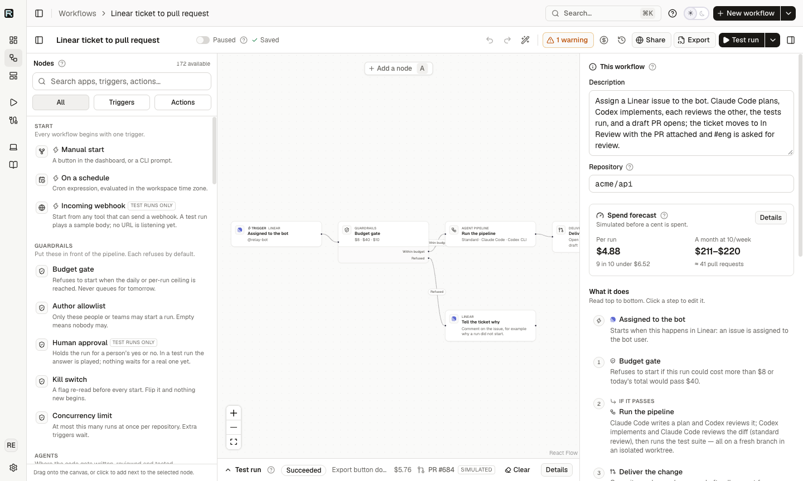
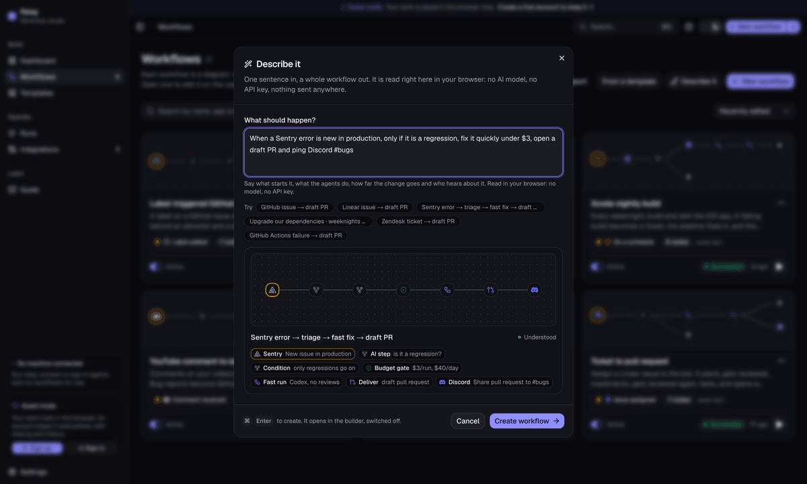
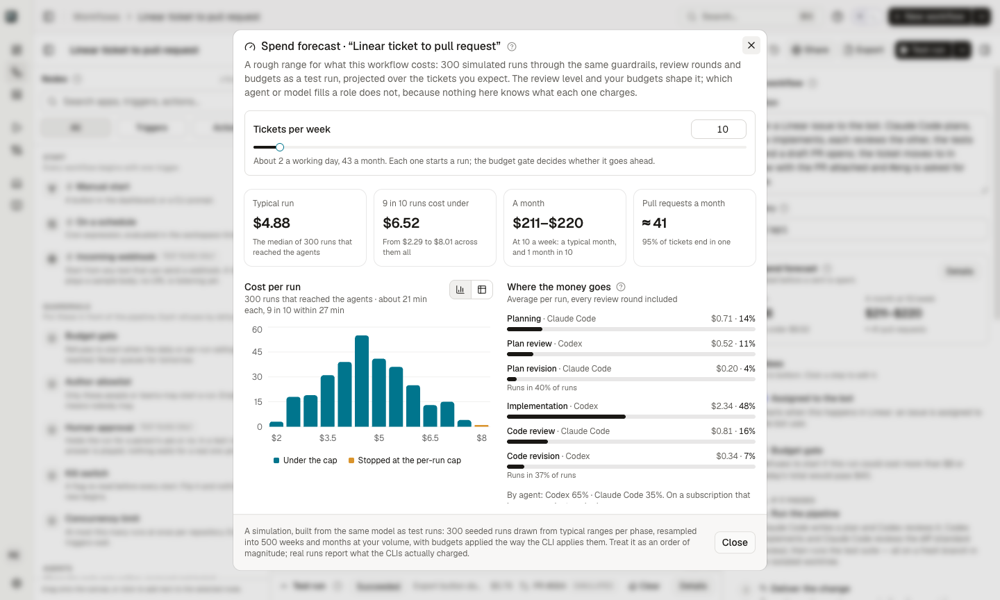

<p align="center">
  <picture>
    <source media="(prefers-color-scheme: dark)" srcset="web/public/brand/relay-logo-dark.svg">
    
  </picture>
</p>

# Relay

[](https://github.com/aydinmrnv/relay/actions/workflows/ci.yml)
[](LICENSE)


**Ticket in. Reviewed PR out.** A workflow studio where Claude Code
and Codex plan, cross-review, implement and test your tickets, behind guardrails
you draw on a canvas.

Relay does not take a coding agent's word for it: two rival ones check each
other, and every claim is shown beside what git and your tests say.

**[Watch a real run →](https://relay-olive-omega.vercel.app/r)** — Relay working
on its own repository, played back step by step, with the pull request it
opened. **[Open the playground →](https://relay-olive-omega.vercel.app/play)** — the
builder in your browser, with no account and nothing to install. Or
**[try it free](https://relay-olive-omega.vercel.app)**: make a free account
and your workflows, share links and version history follow you to any browser.
Relay is in beta, and free while it is.



Relay is a workflow builder for coding agents, in the spirit of n8n: you draw a
flow on a canvas once — what starts a run, the guardrails in front of it, the
agents, where the result goes and who hears about it — and Relay runs the same
steps every time a ticket arrives, stopping wherever a guardrail says no.

The canvas is not a mock-up of something else. `relay workflow run` walks the
graph you drew and performs it on your own machine: it evaluates the
conditions, waits at the approval for a person, runs the agents, opens the
pull request and posts in the channel. A step it has no way to perform is
reported as *not performed*, never as done.

What makes it more than an automation canvas is the node in the middle. The
**Agent pipeline** is not one model call. Claude Code and Codex plan the work,
attack each other's plan against the real code, implement it in an isolated git
worktree, review each other's diff and run your test suite, and every claim they
make is checked against git rather than taken at face value. The result arrives
as a commit, a branch or a draft pull request, as far as you allow.

```
 Linear issue ──▶ Budget gate ──▶ Author allowlist ──▶ Agent pipeline ──▶ Deliver ──▶ Slack message
 assigned                                                                 draft PR    "PR #412 is ready"
 ────────────     ────────────────────────────────     ──────────────     ──────────────────────────────
 trigger          guardrails                           the engine         delivery and notification
```

## Quick start

**Try it free:** <https://relay-olive-omega.vercel.app>. Sign in, or create a
free account in the same form, answer four onboarding questions and get a
first workflow built from your answers. Test runs are simulated, so it costs
nothing to try.

To look before you sign up, the **playground** at
[`/play`](https://relay-olive-omega.vercel.app/play) is the same builder with
no account: start from a template, a sentence or a blank canvas, test-run it,
read the spend forecast and export it. Your work stays in that browser, and
what you changed is offered to you when you make an account there. Share links, version history and
Relay Cloud need the account. (A development copy, `npm run dev` without Clerk
keys, opens the whole studio without an account.)

**Connect your computer** to make it real. The `relay` CLI is the studio's
companion: run it in the repository your workflows work on, and the studio can
sign in your own Claude Code and Codex, run a workflow for real there, and
install its export.

```bash
npm install -g https://github.com/aydinmrnv/relay/releases/download/cli-latest/relay.tgz
cd ~/code/your-repo
relay connect          # opens the studio and pairs it
```

Your browser asks once whether the studio may reach apps on your device —
choose **Allow**; that is `relay connect`, on 127.0.0.1 only. Each start of
`relay connect` pairs afresh, through the link it opens, and the first run or
install a studio asks for is confirmed in its terminal. (Node 22.6 or later. The tarball is the
CLI prebuilt by CI; `npm install -g github:aydinmrnv/relay` installs an empty
package on current npm.)

1. **Open the studio** and start from a template, or from a blank canvas.
2. **Test-run it** with a sample ticket or your own JSON payload. Nodes and edges
   light up as the run travels, with the same phases, review rounds, budgets and
   refusals as a real run — and it costs nothing, because it is simulated.
3. **Run it on your computer.** With `relay connect` running, pick *Run on your
   computer* next to Test run, name an issue or describe the change, and watch
   the same canvas light up from a real run: the plan, the reviews, the diff,
   the tests and the pull request, with what the CLIs actually charged.
4. **Export it** to run unattended. *Install into your repository* writes the
   workflow, the engine's config and a GitHub Actions workflow straight into it
   (or download them as a `.zip`), and the export lists each secret to add.
   Then either keep its trigger on a machine of your own, where every step
   runs as drawn:

   ```bash
   relay workflow check                 # what each step needs, and what Relay cannot perform
   relay workflow serve                 # listen for its webhook, its schedule, its label
   ```

   or commit the files, and a label on a GitHub issue starts the pipeline on
   your own Actions minutes.

The **Guide** (`/guide`) walks through the same path and explains every concept
the studio uses.

## What only Relay does

- **Two vendors check each other.** The model that reviews a plan or a diff is
  never the one that wrote it (below).
- **The workflow you drew is the workflow that runs.** One table says which
  steps Relay performs, and the engine and the studio read the same copy of
  it: the canvas badges a step "test runs only" exactly when a real run would
  skip it, and a real run says "not performed" rather than pretend. Today
  that badge is on one node.
- **Receipts.** Each check a run makes is kept as a row: what an agent claimed,
  what Relay measured, where each came from, and whether they agree. A row with
  no claim to compare says "measured"; a row with nothing measured says
  "unverified". Neither is counted as agreement.
- **Recordings.** `relay recording` writes a finished run to one file, cleaned
  of this machine's paths and of anything shaped like a credential, and the
  studio plays it back at [`/r`](https://relay-olive-omega.vercel.app/r): drag
  to any moment and read the plan, each review and its answers, the diff and
  the test log as they stood. The three on the site are Relay's own runs on
  this repository, pull requests #43, #61 and #49, unedited: one passed, one
  failed its own test run, one failed outright.
- **Describe it, get a workflow.** Type one sentence — *"when a Sentry error is
  new, fix it under $3 and ping Discord"* — and the graph builds itself as you
  type. It is a parser over the live connector catalog, in your browser: no model
  call, no credits, nothing sent anywhere.
- **A spend forecast before the first run.** Hundreds of simulated runs of your
  exact graph give a typical and a bad-day cost per run, a monthly bill at your
  ticket volume, and how often your budget gate will refuse.
- **Share, remix and badge.** Publish a workflow at a public link with secrets,
  links, email addresses, logins and your repository name removed; anyone can
  remix it into their own studio, and a README badge points to it.
- **Version history.** A snapshot before every editing session, named versions
  on demand, and a restore you can undo.
- **Your subscriptions, your runners.** No API keys to paste. Agents run on your
  computer or your own Actions minutes, where Relay never sees your code.

| Describe it | Spend forecast |
|---|---|
|  |  |

## How a workflow is built

A workflow is a graph of nodes. Every node's ports are typed — an issue, a run,
a change, a message, an event — so the canvas refuses a connection that makes no
sense, like wiring a ticket into something that expects a pull request.

| Building block | Nodes |
|---|---|
| **Triggers** | What hands the agents a task. Kept for real by `relay workflow serve`: an incoming webhook, a schedule, a label on a GitHub issue, and the webhooks GitHub, Linear and Sentry send themselves (an issue assigned or labelled, main going red, a security alert, a new error). A manual start works anywhere. The rest can be designed and test-run, and are started by hand or through an Incoming webhook until something reads their events: Jira, Shortcut, GitLab CI, CircleCI, Buildkite, Datadog, Crashlytics, Snyk, LaunchDarkly, Slack, Zendesk |
| **Guardrails** | Budget gate, author allowlist, injection screen, human approval, concurrency limit, kill switch. Each refuses by default and says why. An approval is real: the run waits until a person answers, in the studio or with `relay workflow approve` |
| **Agent pipeline** | Run the pipeline (choose the planner, plan reviewer, implementer and code reviewer, the review depth and the round limits), a fast run with no reviews, or a cost estimate |
| **Delivery** | Deliver the change — commit, branch or draft pull request — and comment the summary on the issue. A run started from the studio or by an event stops at a pull request; only `relay run` at a terminal, with a person there, can be allowed to merge |
| **Logic** | Condition, filter, an AI step for triage or classification, merge paths, wait, wait for business hours, notes. Performed in a real run, and a Filter is evaluated the same way in a test run. The AI step is one read-only turn of your own Claude Code or Codex: Relay calls no model API. Transform passes its payload through unchanged. The exported GitHub Action cannot evaluate them, and says which it left out |
| **Actions** | What closes the loop where the work was asked for: move the ticket and attach the PR, ask Slack for review, link the fix on the Sentry issue, leave support an internal note, call any HTTP endpoint. Performed today in Slack and Discord (a webhook), GitHub (`gh`), Linear (its API) and over HTTP. A step in any other app is handed to a bridge URL of yours, or skipped and reported |

Select a node and the side panel shows its settings, what it will do with them,
and what it did in the last test run. Select nothing and the panel reads the
whole workflow back in plain English, with the apps and sign-ins it needs and
every check it has not passed.

### Templates

Each template is a situation teams hand to coding agents, with its guardrails
already in place. Each one says how it runs today. Seven of the ten start by
themselves under `relay workflow serve`: a label, a schedule, and the events
GitHub, Linear and Sentry deliver. The Zendesk, Slack and LaunchDarkly ones are
started by hand, or from an Incoming webhook, until something reads those
apps' events. A workflow made from a template starts paused. The catalog is kept to the ~45 apps these
situations involve; anything else is one Incoming webhook or HTTP request away.

| Template | For when |
|---|---|
| Linear ticket to pull request | Small, well-written tickets sit in the backlog. Assign one to the bot: it comes back In Review with a draft PR attached, and #eng is asked for review |
| GitHub label to pull request | A maintainer hands over an issue with one label, behind a kill switch, an allowlist and a budget. Runs unattended today through the exported Action |
| Price new tickets before anyone picks them up | Every new Linear issue gets an estimate of what an agent run would cost, with no agent called; cheap ones are labelled agent-ready |
| Fix main when CI goes red | The failing job and its log become the task. One fix at a time, under a budget; #builds gets the PR, or the reason there is none |
| Sentry error to fix | A model reads the trace first. Fixable errors get a PR linked on the Sentry issue; ones needing a product decision become a Linear ticket |
| Fix high-severity code scanning alerts | A new CodeQL alert is fixed with a thorough cross-review and opened as a draft PR for the security team |
| Weekly dependency upgrades that pass CI | Every Monday the agents upgrade what they can, fix what breaks, and open one PR that already builds |
| Remove feature flags that finished rolling out | A LaunchDarkly flag that has served one variation for 30 days gets a PR deleting it and the dead path |
| Customer bug report to fix, with approval | A Zendesk ticket tagged `bug` is checked for repro steps, filed in Linear, approved by an engineer, fixed, and support gets an internal note with the PR |
| Fix it from Slack | React with :robot_face: to a bug report; it becomes a Linear ticket and the draft PR is posted back in the thread |

## Running a workflow for real

There are three ways, and they use the same engine.

**On your computer, from the studio.** With `relay connect` running in your
repository, *Run on your computer* sends the compiled workflow to the companion,
which performs every step of it there with your own sign-ins and streams each
back to the canvas: a guardrail that passed, an approval that is waiting for
you (answer it from the run panel), the plan, the reviews, the diff and the
tests, the pull request, the Slack message. The kill switch and the allowlist
decide whether an *event* may start a run, so a person pressing the button
passes them; the per-run cost cap still applies, and delivery stops at a pull
request. Reload the tab mid-run and the studio picks the run back up.

**Unattended, on a machine of your own.** `relay workflow serve` keeps the
workflow's trigger and runs the whole graph each time it fires:

```bash
relay workflow check ticket-to-pr     # what each step needs; which steps Relay cannot perform
relay workflow run ticket-to-pr --prompt "Fix the flaky retry test" --dry-run
relay workflow serve ticket-to-pr     # an incoming webhook, a schedule, a label, or the app's own events
relay workflow approve ap-7kq2m9xt    # the yes a Human approval step is waiting for
```

A run a trigger starts is unattended, with everything that means below: it
stops at a draft pull request, reads only trusted comments, and its agents
never see a secret-named variable. Deliveries are signed (HMAC-SHA256, the
scheme GitHub, Linear and Sentry already use), one sent twice starts one run,
and a delivery that is not the trigger starts nothing and says why. The app
steps read their credentials from the environment — `SLACK_WEBHOOK_URL`,
`LINEAR_API_KEY`, `HTTP_HEADERS` — and those are never handed on to the
agents. [The reference](docs/cli.md#workflows) has every step and every
trigger.

**Unattended, from your repository.** Export compiles the graph into files your
repository already knows how to run — installed straight into it through
`relay connect`, or downloaded as a `.zip`:

| File | What it is |
|---|---|
| `.relay/config.json` | The engine's configuration: which agent plays which role, review depth, round limits, guardrails, how far delivery may go |
| `.relay/workflows/<name>.json` | The whole workflow, compiled for `relay workflow`: every node with its settings filled in, and no secret in it |
| `.github/workflows/<name>.yml` | A GitHub Actions workflow that runs the engine on your own runner minutes |
| `SETUP.md` | The secrets to add, and where each one comes from |
| `<name>-workflow.json` | The graph itself, to import back into the studio |

The exported Action is narrower than `relay workflow`: it works on one GitHub
issue per run and decides its guardrails inside Relay, so it cannot evaluate a
Condition or wait for an approval. A GitHub issue trigger (a label added, an
issue opened or assigned, a comment) becomes an Actions event, and the run
still requires the trigger label and a labeller on the allowlist. Any other
trigger exports as a workflow you start yourself with an issue number
(`workflow_dispatch`), or from anything that can send an HTTP request
(`repository_dispatch`), and the export says so. Slack, Discord and HTTP
actions are wired straight into the YAML; any other app is posted as JSON to a
bridge URL you choose, such as an n8n or Zapier webhook or your own server.

Whatever the canvas cannot express in the Action is listed as a warning in the
export and in `SETUP.md`. A workflow with errors, placeholder names on its
allowlist or no repository does not export. Secrets you typed into a node are
never written to the files; they become named repository secrets. A paused
workflow exports with its trigger switched off.

## Bring your own subscription

There are no API keys to paste. Claude Code signs in with your Claude plan and
Codex with your ChatGPT plan: through `relay connect`, the studio starts each
CLI's own login on your computer and then asks that CLI whether it worked. The
sign-in stays in that CLI's own files; Relay does not read or store it.

Codex has a second way in: **Continue with ChatGPT**. OpenAI's Sign in with
ChatGPT lets you authorize Relay itself to use your ChatGPT plan, so Codex needs
no login of its own, and what Relay may spend is a limit you set for it under
[Usage in ChatGPT's settings](https://chatgpt.com/settings/usage). Start it from
the studio's Agent accounts card or with `relay chatgpt login`. This is the one
credential Relay holds: an OAuth token in an owner-only file under `~/.relay`
on your machine, handed to the Codex process that spends it and to nothing else.
It never reaches the studio or `.relay/`. It is for Relay on your own computer;
Relay Cloud machines keep using Codex's own sign-in.

In GitHub Actions the export uses each vendor's supported way of carrying a
personal plan into CI — `CLAUDE_CODE_OAUTH_TOKEN` from `claude setup-token`, and
`CODEX_AUTH_JSON` holding `~/.codex/auth.json` — or API keys, if you prefer them.
Those are secrets of your repository, passed to each vendor's own process.

Relay Cloud, the hosted runner, is an invite-only beta. Each person gets a
cloud machine of their own and signs Claude Code, Codex and GitHub in there
through the vendors' own pages. Those sign-ins, and the checkout, are on that
machine's disk, which Relay operates; they are not copied anywhere else, and
they go when you remove the machine.
[The design](docs/design/relay-cloud-runners.md) covers how that machine is
run, reached, kept cheap and kept working.

What Relay itself holds: the notification connections you add in the studio (a
Slack or Discord webhook, which can post to one channel and nothing else),
encrypted with a key only the server has. The one credential the CLI reads is
a Linear API key, from `LINEAR_API_KEY`, when an issue lives in Linear.

## Why a run nobody watched is worth reading

Running agents is the easy part. These are the rules that make the result
trustworthy. The engine enforces them on every run, and the studio checks the
ones a graph can break before it lets you test-run or export:

- **Nothing grades its own homework.** By default the model that reviews a plan
  or a diff is the other CLI, not the one that wrote it, and the studio warns if
  you give both roles to one. Reviewers run read-only, and an agent with no
  read-only mode cannot be made a reviewer at all.
- **Every claim is checked against git.** Relay computes the diff itself, judges
  tests by exit code and takes cost from what the CLIs report. An agent saying
  "done" proves nothing.
- **Unattended runs never merge.** A ticket assignment, a label, a schedule or a
  webhook is an unattended start; those runs stop at a draft pull request, and
  the studio refuses to export anything else.
- **Guardrails refuse by default.** An empty allowlist means nobody may start a
  run, and an unattended workflow will not start without a per-run and a daily
  budget. On GitHub Actions every job starts on a clean machine, so there is no
  record of the day's spend to add to: the per-run cap is what holds there, and
  the daily budget and the audit trail work where `relay serve` keeps its state.
- **Nothing leaves unscanned.** Delivery runs a secret scan between commit and
  push, and a hit stops the change at a local branch.
- **An unattended run screens what it is about to read.** An issue whose text
  matches a known prompt-injection phrasing (an instruction to ignore
  instructions, a forged system message, text hidden in an HTML comment, a
  network command paired with a credential) starts nothing until a person has
  read it. It is a list of patterns, and it is not what makes a hostile issue
  safe: the rules above and [the rest](docs/cli.md#untrusted-input) are. You
  can attack it yourself in the [playground](https://relay-olive-omega.vercel.app/play):
  *Start from → A hostile issue*.
- **Your checkout is only read.** Agents work in a separate git worktree.

What these rules do not do is contain the agents. Nobody is at the terminal to
answer a prompt, so Relay starts Claude Code with `--permission-mode
bypassPermissions` and Codex with `approval_policy="never"`. Codex runs in its
own sandbox in every role. Claude Code's read-only turns (planning, reviewing)
are wrapped in an OS sandbox on macOS, and on Linux when bubblewrap is
installed; a Claude Code implementer is not sandboxed anywhere, and can do what
your account can do. Publishing commands are denied to every agent by name.
Seat Codex as the implementer if that is more than you want to hand over.

The full list, how each rule is enforced, and which role is confined by what
on which operating system, is under [Safety](docs/cli.md#safety) in the engine
reference.

## Status

Relay is in beta at <https://relay-olive-omega.vercel.app>, and free while it
is. The hosted studio needs a free account, which keeps your workflows, runs
and settings in any browser, up to 300 workflows; the playground at `/play`
and a development copy without accounts keep them in your browser's storage. Everything that needs your
computer — agent sign-in, real runs, installing an export — goes through
`relay connect`, which pairs with the hosted studio as readily as with a local
one. Relay Cloud, a cloud machine per person signed in with that person's own
plans ([how it works](docs/design/relay-cloud-runners.md)), is an invite-only
beta: write to support@nullstack.one to ask for access.

| Works today | Simulated in the studio | Not built yet |
|---|---|---|
| Accounts (Clerk: email, Google, GitHub), onboarding, cloud sync, share links and remixes, version history | | |
| The builder, describe-to-workflow, validation, the plain-English description, the spend forecast and the export | Test runs: phases, costs, refusals and PR numbers are played back, deterministically | |
| Running a workflow as drawn, with `relay workflow run` or *Run on your computer*: guardrails, conditions, filters, the AI step, waits, the pipeline, delivery | Transform: its payload passes through unchanged | A sandbox to run Transform's JavaScript in |
| Human approval: the run waits for a yes or a no, from the studio's run panel or `relay workflow approve` | | Approvals asked and answered in Slack or by email |
| Triggers kept by `relay workflow serve`: an incoming webhook, a schedule, a label on a GitHub issue, and the webhooks GitHub, Linear and Sentry send (read from the apps' documented deliveries, not yet exercised against the live services) | Every other app's trigger: Jira, Zendesk, Slack, LaunchDarkly, the other CI services | Reading those apps' events directly |
| Steps in Slack and Discord (a webhook), GitHub (`gh`), Linear (its API), and HTTP requests | Steps in every other app, unless you give them a bridge URL: then they are posted there, and otherwise reported as not performed | A connection to every app |
| Through `relay connect`: signing in to Claude Code and Codex, running a workflow on your computer, answering its approvals, installing an export | | |
| Connecting Slack and Discord in the studio: the webhook is checked with the app, kept encrypted, and rechecked from the dashboard | Other apps' connections: "Mark ready" records a label and signs in to nothing | Sign-in for every connector; a real run using the studio's stored connections rather than the runner's environment |
| Relay Cloud (invite-only beta): a machine of your own on Azure, woken for a run and put to sleep when idle. It runs the pipeline and its delivery | | The whole workflow, and triggers, on Relay Cloud |
| Exported workflows running on GitHub Actions, started by a label on a GitHub issue | | The Action evaluating the canvas's own decisions |
| The playground (`/play`, no account), recordings of real runs (`/r`, `relay recording`) and their receipts | | |
| The engine, from a terminal or from CI, with GitHub and Linear issues | | Org-wide guardrails, an audit log, and a self-hosted runner in your VPC |

The engine reads issues from GitHub and Linear today. The studio lets you design
against every app in the catalog; every node says what a real run does with
it, each template says how it starts today, and `relay workflow check` says
the same about an exported workflow, variable by variable.

## The CLI: the studio's companion, and the engine

The `relay` CLI in `src/` is the studio's side of your computer.

`relay connect` is how the two meet: a small server on 127.0.0.1 that only a
paired studio can use — loopback only, the studio's origin only, a token made
for that start of `relay connect` which travels once, in the fragment of the
link it opens, and a question in the terminal before the first run or install. Through it the
studio starts the vendor CLIs' own sign-ins, runs a workflow in your
repository and streams it back, and installs an export. A run started this way
takes the workflow's steps and the pipeline's shape from the canvas and
everything else from the repository's own config, and stops at a pull request.

Behind the Agent pipeline node is the engine — the same CLI. It is what a run
from the studio performs on your computer, what the exported GitHub Action
runs, and it works on its own from a terminal:

```bash
relay connect                                 # pair with the studio
relay start                                   # dependencies, sign-in, config, and a first run
relay run 142                                 # the pipeline: a GitHub issue, a Linear ID, or a spec file
relay run --prompt "Fix the flaky timeout in the retry test"
relay workflow run ticket-to-pr 142           # a whole workflow from the studio, as drawn
relay workflow serve ticket-to-pr             # keep its trigger, and run it each time
```

A run looks like this, and every step leaves a real artifact on disk rather than
a chat transcript:

```
issue
  → plan                    (planner reads the codebase, writes plan.md)
  → plan review             (a different model attacks the plan against the real code)
  → revised plan            (planner answers ACCEPT / REJECT / NEEDS_CLARIFICATION to every finding)
  → implementation diff     (implementer works in an isolated worktree)
  → code review findings    (reviewer reads the diff Relay computed from git)
  → revised implementation  (only BLOCKING findings are routed back)
  → test evidence           (the project's own test command, judged by exit code)
  → delivery                (commit → push → pull request → merge, as far as the policy allows)
```

**[The CLI reference](docs/cli.md)** covers the rest: the companion and its
security, the design, the safety rules, every command, review depth, cost and
budgets, delivery, unattended runs and the GitHub Action, configuration, exit
codes, and Windows.

## Measuring the claim

Relay rests on one claim: that agents reviewing each other's work produce
better changes than one agent working alone. That claim has not been measured
yet. `relay eval` is the harness for measuring it: it runs a fixed set of tasks
through real pipeline runs under different configurations and reports solve
rate, regression rate, cost and review yield, with confidence intervals. No
session has been recorded, so
[`eval/results/RESULTS.md`](eval/results/RESULTS.md) holds no numbers; see
[`eval/README.md`](eval/README.md) for how to produce them. If the numbers do
not support the design, the defaults change.

## Repository layout

| Path | What |
|---|---|
| [`web/`](web/README.md) | The workflow studio: a Next.js app with the builder, templates, runs, integrations and the export |
| `src/` | The `relay` CLI (TypeScript, Node ≥ 22.6): the studio companion in `src/studio/`, the workflow runtime in `src/graph/`, the Relay Cloud hub and runner in `src/cloud/`, and the engine |
| `action.yml` | The GitHub Action that exported workflows run |
| [`docs/cli.md`](docs/cli.md) | The CLI reference: the companion and the engine |
| [`docs/design/`](docs/design/relay-cloud-runners.md) | Relay Cloud runners: how they work, and what is next. [How workflows run for real](docs/design/workflow-execution.md), locally and in the cloud |
| [`docs/deploying.md`](docs/deploying.md) | Deploying the studio, and hosting Relay Cloud on Azure |
| [`eval/`](eval/README.md) | The eval harness and its fixtures |
| `test/`, `scripts/`, `bin/` | The engine's tests, CI fixtures and entry point |
| `scripts/azure/` | Deploys the Relay Cloud hub on Azure, and creates a development runner VM |

## Development

```bash
# the studio: embedded Postgres, and accounts once `npx clerk env pull` has written the keys
cd web
npm install
npm run dev            # http://localhost:3000
npm run lint && npm run typecheck && npm test && npm run build

# the engine, from the repository root
npm install
npm run typecheck
npm test               # no network, no real agents
```

CI runs the engine's suite on macOS, Linux and Windows, runs the Action against
a fixture repository, and lints, typechecks, tests and builds the studio.
[CONTRIBUTING.md](CONTRIBUTING.md) says what a change needs.

Deploying the studio on Vercel, hosting the Relay Cloud hub on Azure and
making a development runner VM are in [docs/deploying.md](docs/deploying.md).

## License and security

Relay is open source under the [MIT License](LICENSE), copyright NullStack.one.
Report a vulnerability to support@nullstack.one as described in
[SECURITY.md](SECURITY.md); changes are listed in [CHANGELOG.md](CHANGELOG.md).
